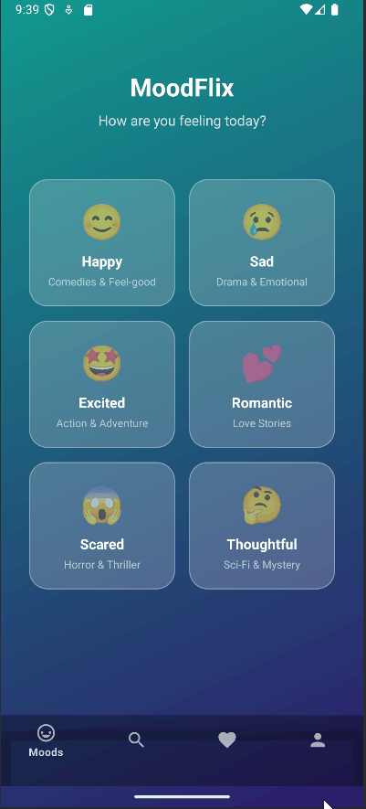

<!-- (This is a comment) INSTRUCTIONS: Go through this page and fill out any **bolded** entries with their correct values.-->

# AND101 Milestone 2 - **Team/App Name**

Submitted by:
- **Leon Fong**
- **Gyabaah Kyere**
- **Kesiena Berezi**
- **Himank Galundia**
- **Jonatan Paulino**

- **etc**

Time spent: **30** hours spent in total

## Summary

This app provides movie suggestions based on your mood!, **MoodFlix**

## Milestone Requirements

<!-- Please be sure to change the [ ] to [x] for any features you completed.  If a feature is not checked [x], you might miss the points for that item! -->

The following REQUIRED features are completed:

- [X] Assign features to each member of your group
- [X] Establish a goal time for completing each feature

The following REQUIRED files are included:

- [x] Updated 📄 `project_spec.md`, which contains:
  - [x] App Overview (Milestone 1)
  - [x] App Spec (Milestone 1)
  - [x] Checked off 2+ completed features
  - [ ] 2+ Videos/GIFs of build progress

- [x] Our 🎥 Demo Video
  - [x] We have also added the Demo Video Link to the Group Info Form on the course portal.

The following EXTRA features are implemented:

- [ ] List anything else that you added to improve your submission!

## 🎥 Demo Video

Here's a video that demos all of the app's implemented features:
https://youtu.be/Q9Z0BLLmeIo

VIDEO created with **ScreenToGif**

## Notes

Here's a place for any other notes on this milestone!
